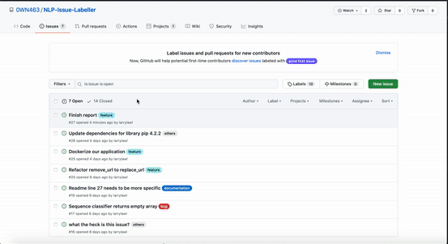

# NLP Issue Labeller
Automatically labelling your github issues with NLP! Code accompanying our [paper](LINK).



## Quickstart
We use python version 3.6.5. 
1. Download the final model [https://drive.google.com/file/d/1JO_I8GNDDwLY4hIeySdhIMwI23kM7Ijx/view?usp=sharing](here).
2. Create a `.env` file in the root repository with the following details.
```
ROOT = 
GITHUB_TOKEN = 
REPOSITORY = 0WN463/CS4248-Project
```

3. Run the following steps to start labelling!
```
pip install -r requirement.txt
python pipeline/scripts/labeller.py
```
